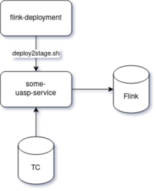

# CI/CD 


## Описание процесса деплоя:
В текущий момент деплоя сервисов uasp выглядит так:
- Внутри репозитория с сервисом создаётся папка: `.teamcity`
- Внутри папка `.teamcity` содержит описание щагов деплоя приложения
- Шаги ссылаются на репозиторий `flink-deployment` который содержит скрипты для деплоя во flink.
- Рядом с папкой `.teamcity` есть папка `conf-deployment` в которой содержаться параметры запуска сервиса
  


## Описание отдельных компонентов:

## Flink-deployment содержит:
1) Папка .teamcity:
   
   Папка builds:
   1) `RunJarFromNexus` - Позволяет запустить джарник из нексуса. 
      Параметры запуска:
      - MAIN_CLASS
      - SAVEPOINT_PATH
      - PARALLELISM
      - PROGRAMARGS
      - env.SERVICE_NAME
      - JAR_NEXUS_URL
      - JAR_ID
   2) `RunJobWSP` - Позволяет запустить джарник из нексуса (Отличия от `RunJarFromNexus` в параметрах). 
      Параметры запуска:
      - SERVICE_NAME
      - SERVICE_VERSION
      - SX_CHECKOUT
      - SXP_PATH
      - SXP_ALLOW_NONRESTORED_STATE
   3) `RunServiceInProd` - Не закончен.
   4) `StopJobWSavePoint` - Позволяет остановить джобу с сейвпоинтом. 
      Параметры остановки:
      - JOB_NAME
      - STOP_DRAIN


   Папка steps(содержит скрипты которые можно вызывать как функции внутри билда):
   1) `CheckDirStep` - Скрипт, который ищет исполняемые файлы и выводит содержимое папки.
   2) `CheckParamsStep` - Скрипт, который проверяет параметры:
      - STAGE 
      - PREFIX_HOST
      - JAR_ID
      - JAR_URL
   3) `CopyFileFromNexusStep` - Скрипт, который загружает джарник из nexus'а, позволяет загружать ограниченное число сервисов:
      - uasp-streaming-main-input
      - uasp-streaming-main-aggregate
      - uasp-streaming-input-convertor
      - uasp-streaming-mdm-additional-enrichment
   4) `UploadFlinkLaunchStep` - Скрипт, который позволяет выгрузить джарник во flink.

2) Папка scripts: Скрипты, используемые на всём протяжении деплоя. 
   Часть скриптов используется в этом же проекте, часть при выгрузке в других проектах. 
   Один из основных скриптов `deploy2stage.sh`, принимающие `STAGE`.
3) Папка stages: Содержит некоторые параметры для различных STAGE'ей. 
   Как правило, это параметры для kafka и flink.
   

```Замечание: Часть ci/cd в регионе, не содержат .teamcity, а ссылающиеся на джобы в unp и input converter'ы. Это временное решение, которое в будующем будем заменено.```

## Быстрое разворачивание ci/cd для нового проекта:
1) Переходим в папку с проектом, копируем туда `.teamcity` из другого проекта.
2) Правим параметры характерные для нового проекта.
3) Пушим в ветки.
4) Заходим в teamcity.
5) Выбираем `New subproject`.
6) Прописываем параметры.
7) Включить `Versioned Settings`
8) Build'ы должны автоматически подтянуться из `.teamcity`.
