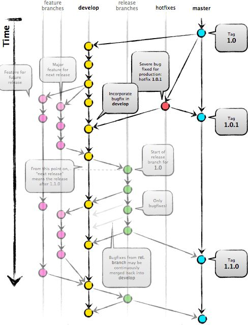
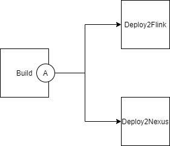
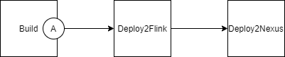

# Правила управления жизненным циклом проекта



#### CI/CD состоит из 3х основных шагов (build config) связанных в один в pipeline (build chain)

1. Build - сборка, прогон unit тестов, отправка в testit (? с веток release/\*, hotfixes/\*, main)
   Зависит от: VCS, git ветка

   Артефакты на выходе: target/*.jar, conf-deployment, pom.xml

   Bouild не производится если изменения были внесены только в папке conf-deployment (trigger rule)

2. Deploy2Flink - деплой jar на кластер flink
   Зависит от: шага #1, файлов настроек conf-deployment для конкретного стенда, скриптов в репозитории flink-deployment
   Нужны стенд выбирается разработчиком. Для стенда >= ift автоматический запуск не производится. 
   
3. Deploy2Nexus - деплой jar файла в nexus repo. (Nexus URL зависит наличия SNAPSHOT  в версии в pom.xml)

   Зависит от: шага #2

Шаги 1,2,3 выполняются автоматически для веток develop и feature/* . Сборка релизной версии на dso приводит к падению билда.

Для веток  release/\*, hotfixes/\*, main выполняется только шаг #1 и , далее разработчик должен зайти в TC на ВРМ и нажать Deploy на нужном ему шаге. В случае Deploy2Flink ему будет предложено выбрать на какой стенд будет задеплоен jar. После деплоя на кластер разработчик решает, нужен ли ему артифакт шага #2 в nexus, нажав Deploy на шаге Deploy2Nexus.

Шаги могут быть построены по двум вариантам. Сейчас реализован вариант 2.

###### Вариант 1.



###### Вариант 2.




#### Настройки окружения на примере (Ubuntu 20.04.3 LTS)

Обновляем git
```
sudo add-apt-repository ppa:git-core/ppa -y
sudo apt-get update
sudo apt-get install git -y
git --version
```

Устанавливаем git flow (опционально)
```
sudo apt-get install git-flow
```

Добавляем gitflow maven plugin в pom.xml  (опционально)
```
<plugin>
	<groupId>com.amashchenko.maven.plugin</groupId>
    <artifactId>gitflow-maven-plugin</artifactId>
    <version>1.16.0</version>
    <configuration>
    	<gitFlowConfig>
        	<productionBranch>main</productionBranch>
         </gitFlowConfig>
    </configuration>
</plugin>
```
Устанавливаем default ветку в main

```
git config --global init.defaultBranch main
```

#### Кейсы для разработчика

**rule "Создать новый функционал"**

**group** new_feature_dso

**when**

​	Необходимо создать новый функционал?

**then**

​	*Разработчик:* 

1. Создать новую ветку из ветки develop с названием максимально приближенным к сути задачи в каталоге  feature/*. 

2. Версия в pom.xml для feature и develop веток должна содержать SNAPSHOT
   
   ##### Начать фичу:
   
   ```
   git checkout -b feature/some-feature develop
   
   # Поменять версию в pom на 1.0.0-some-feature-SNAPSHOT
   # Опционально
   git push -u origin feature/some-feature
   ```
   
   ###### Альтернатива:
   
   ```
   mvn gitflow:feature-start -B -DfeatureName=some-feature
   ```
   
   ##### В процессе творчества:
   
   ```
   git status
   git add some-file
   git commit -m "add some comment"
   ```
   
   ##### Закончить фичу:
   
   
   
   ```
   git pull origin develop
   git checkout develop
   git merge --no-ff feature/some-feature
   #Поменять версию в pom на 1.0.0-SNAPSHOT
   git push origin develop
   
   git branch -d feature/some-feature
   
   # If you pushed branch to origin:
   git push origin --delete feature/some-feature
   ```
   ###### Альтернатива:
   
   ```
   mvn gitflow:feature-finish -B -DfeatureName=some-feature
   ```

**end**


**rule "Проверить новый функционал на кластере"**

**group** new_feature_dso

**when**

​	Необходимо проверить новый функционал на кластере dso?

**then**

​	*Разработчик:* 

3. Выполняет push ветки в git remote feature/* или develop

​    *CI/CD:* 

1. Собирает SNAPSHOT и деплоит его на кластер DSO
   название артифакта для ветки:
   
   - develop: $artifactId-$version
   - feature/*: $artifactId-$featureName-$version
   
   название джобы flink для ветки:
   
   - develop: $названиеEnvФайлаИзСonf-deployment--$version
   - feature: $названиеEnvФайлаИзСonf-deployment--$featureName--$version
   
   В случае, если версия не содержит SNAPSHOT, и push произведен из веток feature/* или develop происходит исключение CI/CD.
   
   В случае, если необходим деплой релизной версии jar на dso необходимо воспользоваться TC deploy configuration  на dso - UASP/GitFlow/JobJuggler/RunJarFromNexus или сделать reset на соответствующий commit в develop ветке из которого сделан release.

**end**


**rule "Создать новый релиз из веток с новым функционалом"**

**group** new_release

**when**

​	Необходимо новый функционал собрать в новый релиз?

**then**

​	*Разработчик:* 

1. Выполнить merge всех веток с новым функционалом в develop
2. Инкрементировать 2ю цифру в номере версии в develop: 1.0.0-SNAPSHOT -> 1.1.0-SNAPSHOT
3. Выполнить push в develop
4. Создать новую ветку из develop с названием release/N ,где N - номер версии из шага #1 без SNAPSHOT: 1.1.0-SNAPSHOT -> 1.1.0
5. Выполняет push в release
6. Переходит в TC ВРМ и выбирает необходимы ему стенд для деплоя (ift, nt, real)
7. Если необходимы изменения в release делает их без фиксации дистрибутива в nexus. Сделанные изменения возвращает в develop.
8. После стабилизации release, разработчик запускает шаг деплоя в nexus, делает push в develop и main, ставит tag 1.1.0.
9. В случае необходимости тестирования hotfix на dso нужно перейти на нужный commit в develop и работать в dso.

​    *CI/CD:* 

1. Собирает jar-файл с релизной версией, но не запускает стадию деплоя во Flink и Nexus
2. Deploy во Flink и Nexus происходит в полуавтоматическом режиме с выбором стенда разработчиком

##### Начать релиз:

```
git checkout -b release/1.0.0 develop

# Optional: Bump version number, commit
# Prepare release, commit
```

###### Альтернатива:
```
mvn gitflow:release-start -B -DversionDigitToIncrement=1 -DpushRemote=true
```

##### Закончить релиз:

```
git checkout main
git merge --no-ff release/1.0.0
git push

git checkout develop
git merge --no-ff release/1.0.0
#Поменять версию в девелоп на 1.1.0-SNAPSHOT
git push

git branch -d release/1.0.0

# If you pushed branch to origin:
git push origin --delete release/1.0.0

git tag -a v1.0.0 main
git push --tags
```

###### Альтернатива:

```
mvn gitflow:release-finish -B -DversionDigitToIncrement=1 -DpushRemote=true
```

**end**


**rule "Внести исправления в созданный релиз (hotfix)"**

**group** new_hotfix

**when**

​	В релизе обнаружены ошибки

**then**

​	*Разработчик:*   

1. Создаёт ветку вида hotfix/1.1.(+1) от main tag необходимой версии, в которой найдена ошибка
2. Меняет версию в pom на 1.1.(+1) и вносит изменения
3. Тестирует на (ift, nt, real)
4. Делает push в develop и main, ставит tag 1.1.0.
5. Фиксирует артифакт в nexus

*CI/CD:*  

1. Собирает jar-файл с релизной версией (1.1.1), но не запускает стадию деплоя во Flink и Nexus
2. Deploy во Flink и Nexus происходит в полуавтоматическом режиме с выбором стенда разработчиком

##### Начать hotfix:

```
git checkout -b hotfix/1.0.1 main

# Поменять версию на 1.0.1
# Fix the bug, commit
```

###### Альтернатива:

```
mvn gitflow:hotfix-start -B -DgitflowDigitToIncrement=2 -DpushRemote=true
```

##### Закончить hotfix:

```
git checkout main
git merge --no-ff hotfix/1.0.1
git push


git checkout develop
git merge --no-ff hotfix/1.0.1
#Поменять версию в девелоп на 1.0.1-SNAPSHOT
git push

git branch -d hotfix/1.0.1

git tag -a v1.0.1 main
git push --tags
```

###### Альтернатива:
```
mvn gitflow:hotfix-finish -B -DgitflowDigitToIncrement=2 -DpushRemote=true -DhotfixBranch=hotfix/1.0.1
```

**rule "Изменение в конфигурации сертификатов для доступа к kafka в контуре DSO"**

**group** main

**when**

​	Изменены сертификаты kafka на кластере dso?

**then**

​	*Разработчик:* 

1. Изменить конфигурацию в ветке develop  в файлах https://bitbucket.region.vtb.ru/projects/DRPIM/repos/flink-deployment/browse/stages/dso/.env
2. Выполняет commit и push ветки master

​    *CI/CD:* 

1. Применяет изменения при следующих запсках пайплайна

**end**


