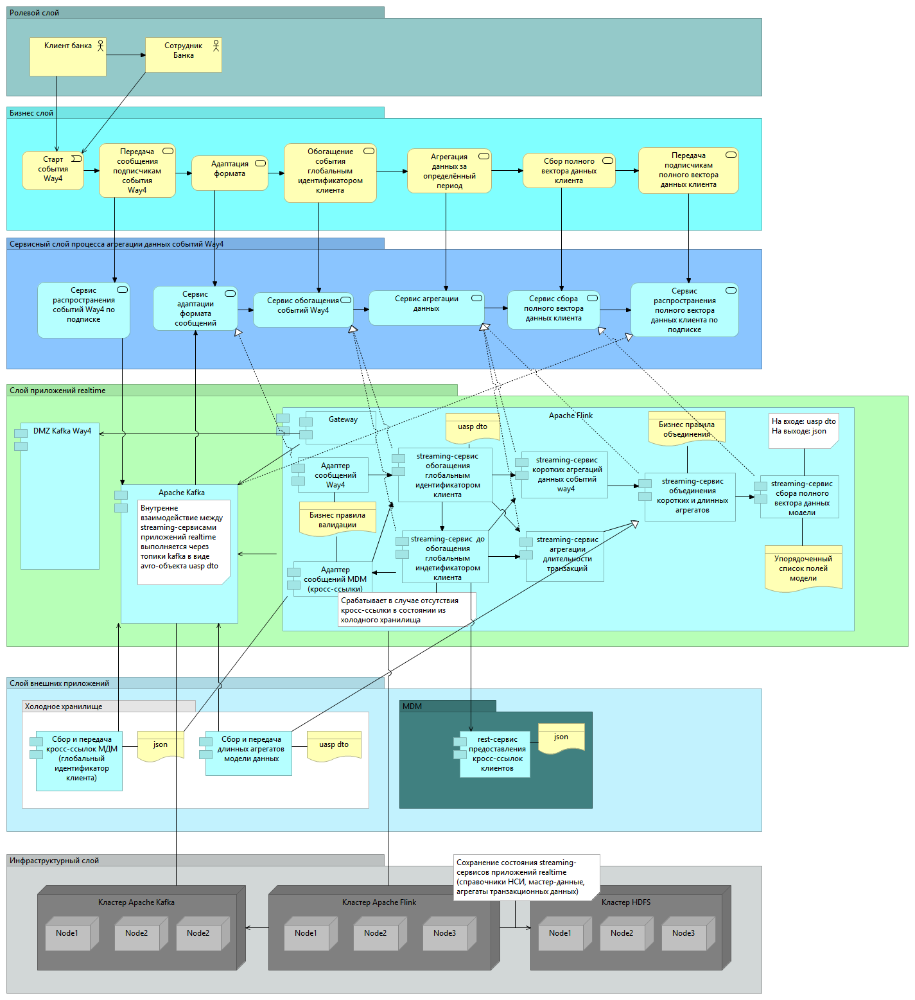
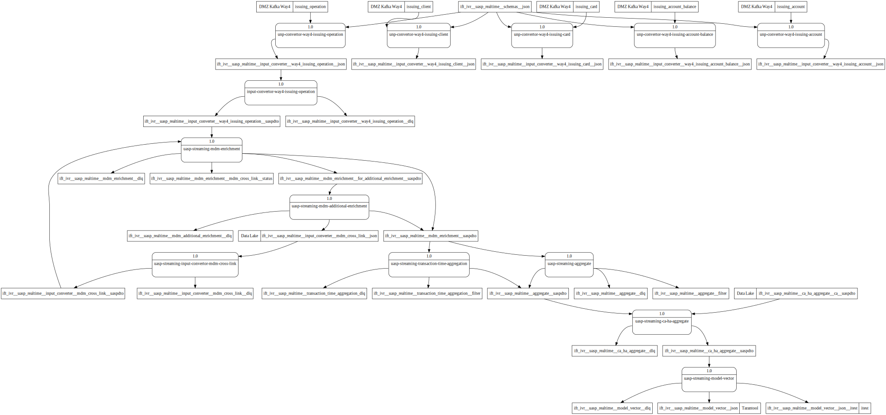

# Интеграция с Way4

## Общая схема интеграции

Основные правила разработки streaming-сервисов описаны в
разделе: [Описание архитектуры микро сервисов универсальной аналитической стриминговой платформы](./../../architecture.md)

Схема потоков данных:

### Адаптер сообщений Way4 - uasp-streaming-input-convertor

*Ссылка на проект*:
https://bitbucket.region.vtb.ru/projects/DRPIM/repos/uasp-streaming-input-convertor/browse

***Входящий поток***:  dev_ivr__uasp_realtime__way4_issuing_operation__json

​    *Ключ сообщения*: Локальный идентификатор клиента

​ Формат сообщения входящего потока json сообщения описание схемы:

***Исходящий поток***: dev_ivr__uasp_realtime__way4_issuing_operation__uaspdto

​    *Ключ сообщения*: Локальный идентификатор клиента

​ Формат сообщения исходящего потока avro-объект UaspDto

### Адаптер сообщений MDM (кросс-ссылки) - uasp-streaming-mdm-convertor

*Ссылка на проект*:

https://bitbucket.region.vtb.ru/projects/DRPIM/repos/uasp-streaming-mdm-convertor/browse?at=refs%2Fheads%2Fdevelop

***Входящий поток***:  dev_ivr__uasp_realtime__mdm_cross_link__json

​    *Ключ сообщения*: УИК - универсальный идентификатор клиента

​ Формат сообщения входящего потока - json сообщение, описание схемы:

https://wiki.corp.dev.vtb/pages/viewpage.action?pageId=539457439

***Исходящий поток***: dev_ivr__uasp_realtime__mdm_cross_link__uaspdto

​    *Ключ сообщения*: УИК - универсальный идентификатор клиента

​ Формат сообщения исходящего потока avro-объект UaspDto

### Streaming - сервис обогащения глобальным идентификатором клиента - uasp-streaming-mdm-enrichment

*Ссылка на проект*:

https://bitbucket.region.vtb.ru/projects/DRPIM/repos/uasp-streaming-mdm-enrichment/browse?at=refs%2Fheads%2Fdevelop

***Входящий поток***:  dev_ivr__uasp_realtime__way4_issuing_operation__uaspdto - от адаптера сообщений Way4  
dev_ivr__uasp_realtime__mdm_cross_link__uaspdto - от адаптера сообщений MDM

​    *Ключ сообщения*: Локальный идентификатор клиента для обоих адаптеров

​ Формат сообщения входящего потока avro-объект UaspDto

***Исходящий поток***: dev_ivr__uasp_realtime__mdm_enrichment__uaspdto - для сервиса коротких агрегаций  
dev_ivr__uasp_realtime__for_additional_enrichment__uaspdto - для сервиса дообогащения

​    *Ключ сообщения*: Локальный идентификатор клиента для сервиса дообогащения  
Универсальный идентификатор для сервиса коротких агрегаций

​ Формат сообщения исходящего потока avro-объект UaspDto

### Streaming - сервис дообогащения глобальным идентификатором клиента - streaming-mdm-additional-enrichment

*Ссылка на проект*:

https://bitbucket.region.vtb.ru/projects/DRPIM/repos/uasp-streaming-enrichment-global-user-identifier/browse - будет
переименован

***Входящий поток***:  dev_ivr__uasp_realtime__for_additional_enrichment__uaspdto

​    *Ключ сообщения*: УИК - универсальный идентификатор клиента

​ Формат сообщения входящего потока avro-объект UaspDto

***Исходящий поток***: dev_ivr__uasp_realtime__mdm_enrichment__uaspdto - для сервиса коротких агрегаций  
dev_ivr__uasp_realtime__mdm_cross_link__json - для адаптера MDM

​    *Ключ сообщения*: УИК - универсальный идентификатор клиента для сервиса и адаптера

​ Формат сообщения исходящего потока avro-объект UaspDto для сервиса коротких агрегаций  
​ Формат сообщения входящего потока для адаптера MDM - json сообщение, описание схемы:

https://wiki.corp.dev.vtb/pages/viewpage.action?pageId=539457439

### Streaming - сервис коротких агрегаций данных событий way4 - uasp-streaming-aggregate-mvp

*Ссылка на проект*:

https://bitbucket.region.vtb.ru/projects/DRPIM/repos/uasp-streaming-aggregate-mvp/browse?at=refs%2Fheads%2Fdevelop

***Входящий поток***:  dev_ivr__uasp_realtime__mdm_enrichment__uaspdto

​    *Ключ сообщения*: УИК - универсальный идентификатор клиента

​ Формат сообщения входящего потока avro-объект UaspDto

***Исходящий поток***: dev_ivr__uasp_realtime__mdm_aggregate_mvp__uaspdto

​    *Ключ сообщения*: УИК - универсальный идентификатор клиента

​ Формат сообщения исходящего потока avro-объект UaspDto

### Streaming - сервис объединения коротких и длинных агрегатов - uasp-streaming-ca-ha-aggregate-mvp

*Ссылка на проект*:

https://bitbucket.region.vtb.ru/projects/DRPIM/repos/uasp-streaming-ca-ha-aggregate-mvp/browse?at=refs%2Fheads%2Fdevelop

***Входящий поток***:  dev_ivr__uasp_realtime__mdm_aggregate_mvp__uaspdto

​    *Ключ сообщения*: УИК - универсальный идентификатор клиента

​ Формат сообщения входящего потока avro-объект UaspDto

***Исходящий поток***: dev_ivr__uasp_realtime__ca_ha_aggregate__uaspdto

​    *Ключ сообщения*: УИК - универсальный идентификатор клиента

​ Формат сообщения исходящего потока avro-объект UaspDto

### Streaming - сервис сбора полного вектора данных модели - uasp-streaming-model-vector-mvp

*Ссылка на проект*:

https://bitbucket.region.vtb.ru/projects/DRPIM/repos/uasp-streaming-model-vector-mvp/browse

***Входящий поток***:  dev_ivr__uasp_realtime__ca_ha_aggregate__uaspdto

​    *Ключ сообщения*: УИК - универсальный идентификатор клиента

​ Формат сообщения входящего потока avro-объект UaspDto

***Исходящий поток***: dev_ivr__uasp_realtime__model_vector__json

​    *Ключ сообщения*: УИК - универсальный идентификатор клиента

​ Формат сообщения исходящего потока json - сообщение, схема:

https://wiki.corp.dev.vtb/pages/viewpage.action?pageId=552473862

Описание процесса:
1. В топик *dev_ivr__uasp_realtime__way4_issuing_operation__json* из Way4 поступает сообщение о событии в виде json. 
   Адаптер Way4 получает это сообщение из топика, конфертирует его в avro-формат uasp dto и передает его в топик 
   *dev_ivr__uasp_realtime__way4_issuing_operation__uaspdto* для сервиса обогащения.
   При получении невалидного json адаптер Way4 скидывает сообщение в топик *dev_ivr__uasp_realtime__way4_issuing_operation__dlq*
2. Сервис обогащения периодически получает из топика *dev_ivr__uasp_realtime__mdm_cross_link__uaspdto*
   кросс ссылки(соответствия локальных идентификаторов клиентов глобальным), которые хранятся в некой мапе.
   При получении запроса от адаптера Way4 производит поиск глобального идентификатора по его локальному. Если идентификатор найден,
   обогащает сообщение глобальным идентификатором, переодит его в avro формат uasp dto и отправляет в топик *dev_ivr__uasp_realtime__mdm_enrichment__uaspdto*.
   Если глобальный идентификатор не был найден, то получаенное от адаптера Way4 сообщение передается в топик *dev_ivr__uasp_realtime__for_additional_enrichment__uaspdto*
   для сервиса дообогащения.
3. Сервис дообогащения получает запрос из топика *dev_ivr__uasp_realtime__for_additional_enrichment__uaspdto* и по rest пытается получить
   глобальный идентификатор клиента из MDM. В случае, если глобальный идентификатор успешно получен, сервис дообогащения обогащает запрос
   и помещает его в топик *dev_ivr__uasp_realtime__mdm_enrichment__uaspdto* для сервиса коротких агрегаций, а саму кросс ссылку в виде json
   помещает в топик *dev_ivr__uasp_realtime__mdm_cross_link__json* для адаптера MDM.
   Если не удалось получить глобальный идентификатор из MDM, сообщение отправляется в топик *dev_ivr__uasp_realtime__mdm_enrichment__dlq* .
4. Сервис коротких агрегаций данных событий way4 получает сообщения из топика *dev_ivr__uasp_realtime__mdm_enrichment__uaspdto*
   и выполняет свою логику
5. Сервис объединения коротких и длинных агрегаций получает сообщения из топика *dev_ivr__uasp_realtime__mdm_aggregate_mvp__uaspdto*
   и выполняет свою логику
6. Сервис сбора полного вектора получает сообщения из топика *dev_ivr__uasp_realtime__ca_ha_aggregate__uaspdto*, формирует полный вектор
   в формате json и помещает в топик *dev_ivr__uasp_realtime__model_vector__json* для Tarantool

