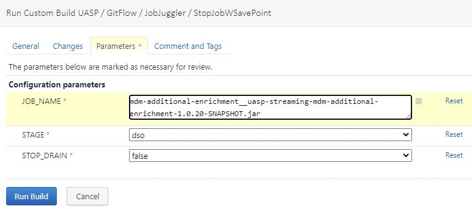
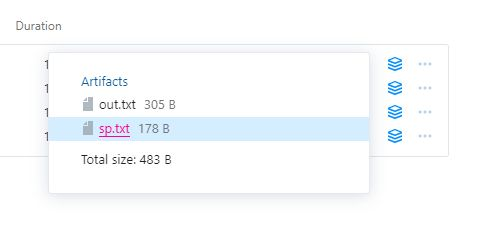
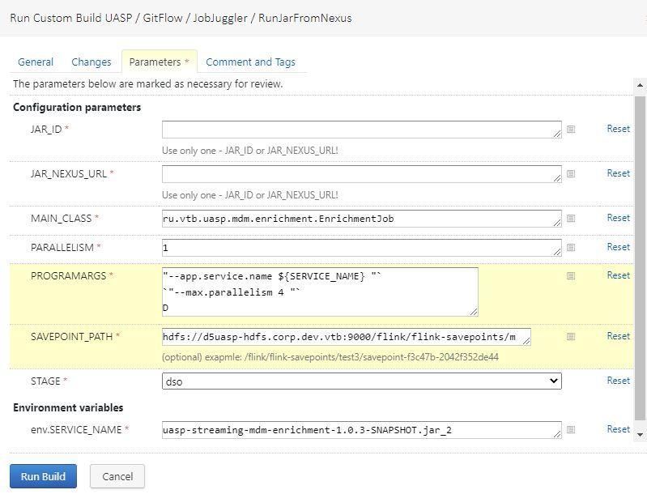
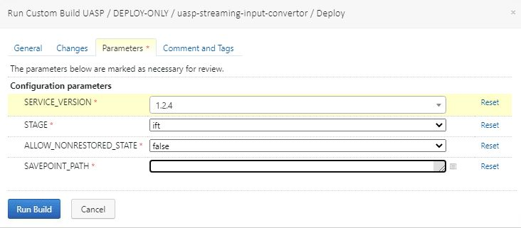

# Остановка и запуск сервисов (job) apache flink с точки сохранения (save point)

### 1. При помощи flink CLI

[Ссылка на документацию](https://nightlies.apache.org/flink/flink-docs-master/docs/deployment/cli/)

Производится с ноды, где установлен flink, под пользователем flink. Примечание: flink -m "адрес удаленного jobmanager" не работает в случае HA кластера.

#### 1.1. Остановка сервиса с сохранением sp

Предварительно выяснить JOB_ID командой `bin/flink list` или через WEB UI

```bash
bin/flink stop -p $JOB_ID
```

Пример:

```bash
bin/flink stop -p 81936beb47bea7af6d9c6e7cc569d2b7
Suspending job "81936beb47bea7af6d9c6e7cc569d2b7" with a savepoint.
Savepoint completed. Path: hdfs://d5uasp-hdfs.corp.dev.vtb:9000/flink/flink-savepoints/savepoint-81936b-cfdee65b368f
```


#### 1.2. Запуск сервиса с sp
Предварительно скачать jar с nexus:
```bash
curl -o ./file.jar -ksL -u vtbxxxxxxx -X GET "https://nexus-ci.corp.dev.vtb/service/rest/v1/search/assets/download?sort=version&repository=drpim-maven-snapshot&maven.artifactId=uasp-streaming-mdm-enrichment&maven.baseVersion=1.3.0-SNAPSHOT&maven.extension=jar"
```

```bash
bin/flink run -d -p PARALLELISM -s SAVE_POINT_PATH -d JAR_FILE PARAMETERS
```

Пример:

```bash
bin/flink run -d -p 3 -s hdfs://d5uasp-hdfs.corp.dev.vtb:9000/flink/flink-savepoints/savepoint-81936b-cfdee65b368f -d file.jar --par1=val1 --par2=val2 
```

При возникновении ошибки вида

*Caused by: java.lang.IllegalStateException: Failed to rollback to checkpoint/savepoint hdfs://d5uasp-hdfs.corp.dev.vtb:9000/flink/flink-savepoints/savepoint-4ad799-669e4f054d06. Cannot map checkpoint/savepoint state for operator b6f95128df0beec67bf08a0f6acc7ae8 to the new program, because the operator is not available in the new program. If you want to allow to skip this, you can set the --allowNonRestoredState option on the CLI.*

пробуем к run добавить ключ -n (--allowNonRestoredState ) - игнорировать несовпадающие uid


### 2. При помощи TeamCity (REST API)

по состоянию на 15.12.2021

[Ссылка на документацию](https://nightlies.apache.org/flink/flink-docs-master/docs/ops/rest_api/)

#### 2.1. Остановка сервиса с sp

##### для dso 

Воспользоваться TC билд конфигурацией [UASP/GitFlow/JobJuggler/StopJobWSavePoint](https://teamcity-cicdl.corp.dev.vtb/buildConfiguration/UASP_GitFlow_JobJuggler_StopJobWSavePoint)

<p align="left">
  
</p>

После выполнения в артефаках, файле sp.txt будет путь до точки сохранения
<p align="left">
  
</p>


##### для ift+ (ВРМ)

[UASP/GitFlow/JobJuggler/StopJobWSavePoint](https://teamcity-cicdl.region.vtb.ru/buildConfiguration/UASP_GitFlow_JobJuggler_StopJobWSavePoint)


#### 2.2. Запуск сервиса с sp

##### для dso
[UASP/GitFlow/JobJuggler/RunJarFromNexus](https://teamcity-cicdl.corp.dev.vtb/buildConfiguration/UASP_GitFlow_JobJuggler_RunJarFromNexus)

<p align="left">
  
</p>
Должно быть указано одно из двух значений JAR_ID или JAR_NEXUS_URL.
PROGRAMARGS - как в conf-deployment/stages/*/env файле.

##### для ift+ (ВРМ)
[UASP/GitFlow/JobJuggler/RunJarFromNexus](https://teamcity-cicdl.region.vtb.ru/buildConfiguration/UASP_GitFlow_JobJuggler_RunJarFromNexus )

Сервисы из проект [UASP/DEPLOY-ONLY](https://teamcity-cicdl.region.vtb.ru/project/UASP_DeployOnly) также предполагают запуск с sp.

<p align="left">
  
</p>
